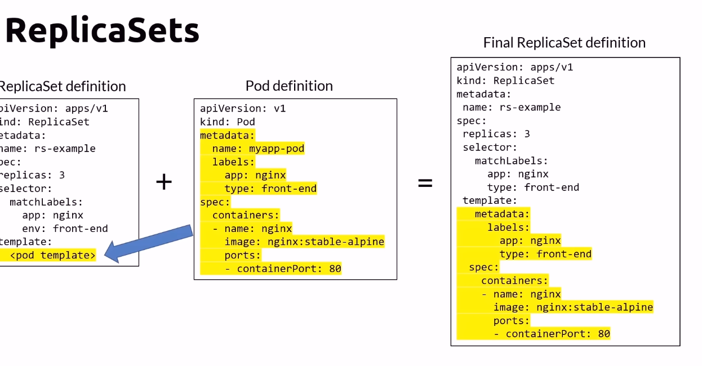

# List name spaces
kubectl get ns

# change context namespace

# Kubectl - Namespace cheat sheet


## K8s Architecture - Master


- **kube-apiserver**: Exposes an REST interface and client tools. Saves state to the datastore (etcd)
- etcd: Key value datastore for cluster state data (Only api server communicate with).
- **kube-control-manager**: controller, of controllers (node controller, replication controller, endpoints controller, service account & Token controllers)
- **cloud-control-manager**: Interact with cloud providers controllers
    - Node: Checking the cloud provider to determine if a node has beed deleted in the cloud after it stops responding.
    - Route: For setting up routes in the underlying cloud infrastructure.
    - Service: For creating, updating and deliting cloud provider load balancers.
    - volume: For creating, attaching, and mounting volumes, and interacting with the cloud provider to orchestrate volumes.
- **kube-scheduler**: Watches newle created pods that have no node assigned, and selects a node for them to run on.
- Addons
    - DNS
    - WEB UI (dashboard)
    - Cluster-level logging
    - container resource monitor

## K8s Architecture - Nodes

A node is a phisical or virtual machine.


- **kubelet**: Manage the pods lifecycle. Are running and healthy
- **kubeproxy**: A network proxy. all network pass behing hm.
- **Container runtime**: cri-i, containerd, moby, rkt, kata, Virtlet

### Nodes pool

Is a group virtual machines, all with the same size.

## Pods


Pods are the smallest atomic unit of work of k8s. Encampsulates an application container. Is deployable.


### Pod creation


### Pod Deletion


### Pod state


## kubectl - pod cheat sheet


## Selector


## Multi-containers pods


### Sidecar


### Adapter


### Ambassador


Book suggestion Designing Distributed Systems

## kubectl - Pod cheat sheet 


## Networking concepts

- All containers within a pod can communicate with each other
- All pods can communicate with each other
- All Nodes can communicate with all pods
- Pods are giben an IP address (ephemeral)
- Services are given a persistent IP

### Container communication


### Pods communication


## Workloads


They had, Pods, ReplicaSets and Deployment

### ReplicaSets

Healing pods to keep number of replicas needed.



#### ReplicaSets cheat sheet


## Pods vs Deployments

## Pods

Pods are the smallest deployable units of computing that can be created and managed in Kubernetes. They lack certain capabilities:

- **Self-heal:** If a Pod crashes, it doesn't restart on its own unless managed by a higher-level controller.
- **Scale:** Pods can't scale up or down on their own.
- **Updates:** They don't have a built-in mechanism for updates.
- **Rollback:** There's no inherent mechanism to roll back to a previous state.

## Deployments

Deployments are high-level constructs in Kubernetes that manage the lifecycle of Pods and provide:

- **Self-heal:** Ensures a specified number of Pods are always running. If a Pod dies, a new one is created.
- **Scale:** Allows for scaling the number of Pods up or down.
- **Updates:** Seamlessly update Pods to new versions.
- **Rollback:** If an update causes issues, easily roll back to a previous version.

In summary, while Pods are the basic units in Kubernetes, Deployments provide management features that simplify handling and maintenance of Pods.

## Kubernetes Deployments

- **Deployments**:
  - Ensures the desired state of your applications in Kubernetes.
  - Automatically creates **ReplicaSets** in the background.
  - It's visually represented as containing a ReplicaSet which manages multiple Pods.

- **ReplicaSets**:
  - Maintains a stable set of replica Pods.
  - Recommended not to interact with directly. Use Deployments for application lifecycle management.


ex:
```yaml
apiVersion: apps/v1
kind: Deployment
metadata:
  name: deploy-example
spec:
  replicas: 3
  revisionHistoryLimit: 3
  selector:
    matchLabels:
      app: nginx
      env: prod
  strategy:
    type: RollingUpdate
    rollingUpdate:
      maxSurge: 1
      maxUnavailable: 1
  template:
    metadata:
      labels:
        app: nginx
        type: prod
    spec:
      containers:
      - name: nginx
        image: nginx:stable-alpine
        ports:
        - containerPort: 80
```

Of course! Here's a continuation for your markdown documentation:

---

### **Kubernetes Deployments - Cheat Sheet**

Kubernetes deployments ensure that a specified number of pod replicas are running at any given time. They are a higher-level concept that manages ReplicaSets and provides declarative updates to pods.

#### **Creating Deployments**

- **Imperatively**
  ```bash
  kubectl create deploy [deploymentName] --image=busybox --replicas=3 --port=80
  ```
  This command quickly creates a deployment with the specified name, image, replicas, and port without a predefined configuration file.

- **Declaratively**
  ```bash
  kubectl apply -f [definition.yaml]
  ```
  Use this command to apply or update a deployment using a predefined YAML configuration file.

#### **Viewing Deployments**

- **List All Deployments**
  ```bash
  kubectl get deploy
  ```
  Shows the status and details of all deployments in the current namespace.

- **Detailed Information on Specific Deployment**
  ```bash
  kubectl describe deploy [deploymentName]
  ```
  Provides in-depth details, including events, conditions, and configuration for a specific deployment.

#### **ReplicaSets**

- **List All ReplicaSets**
  ```bash
  kubectl get rs
  ```
  ReplicaSets ensure that a specific number of pod replicas are running. This command lists all the ReplicaSets in the current namespace.

#### **Deleting Deployments**

- **Using Configuration File**
  ```bash
  kubectl delete -f [definition.yaml]
  ```
  Removes a deployment or any Kubernetes resource defined in a YAML file.

- **Using Deployment Name**
  ```bash
  kubectl delete deploy [deploymentName]
  ```
  Quickly removes a deployment by specifying its name directly.

---

## DaemonSet

A DaemonSet ensures that all nodes run a copy of a specific pod. If new nodes are added to the cluster, the pod gets added to them. Conversely, if nodes are removed from the cluster, those pods are garbage collected.

#### **Key Characteristics**

- **Consistent Pod Instances**: DaemonSets make sure that each node in the cluster runs the specified pod. If there's a node without the pod, the DaemonSet deploys it there.

- **Scheduler Independence**: While typically pods are scheduled by the scheduler, DaemonSet pods are run on suitable nodes by the DaemonSet controller.

- **Dynamic Adaptation**: As nodes join or leave the cluster, the DaemonSet automatically adapts to ensure the correct number of pod instances exist.

#### **Common Use Cases**

DaemonSets are particularly useful for running background tasks on all nodes in a cluster. Some typical uses include:

- **Cluster Storage Daemons**: For instance, to run storage daemons like Glusterd or Ceph on each node.

  ```yaml
  apiVersion: apps/v1
  kind: DaemonSet
  metadata:
    name: storage-daemon
  spec:
    selector:
      matchLabels:
        name: storage-daemon
    template:
      metadata:
        labels:
          name: storage-daemon
      spec:
        containers:
        - name: storage-daemon
          image: storage-image:latest
  ```

- **Log Collection**: Running a log collection daemon on every node, like Fluentd or Logstash.

- **Node Monitoring**: To monitor the health or other metrics of nodes using monitoring agents like Prometheus Node Exporter.


---

### **DaemonSets Cheat Sheet**

For those who manage Kubernetes clusters, the `kubectl` command-line tool is indispensable. When working with DaemonSets, the following commands are especially useful:

#### **1. Create a DaemonSet**

To apply a DaemonSet configuration from a YAML file:

```bash
kubectl apply -f [definition.yaml]
```

#### **2. List DaemonSets**

To view all DaemonSets in the current namespace:

```bash
kubectl get ds
```

#### **3. Get Detailed Info**

To retrieve detailed information about a specific DaemonSet:

```bash
kubectl describe ds [dsName]
```

#### **4. Delete a DaemonSet**

To delete a DaemonSet using its definition:

```bash
kubectl delete -f [definition.yaml]
```

Alternatively, you can delete a DaemonSet directly by its name:

```bash
kubectl delete ds [dsName]
```


## Blue green deployment


The diagram you provided illustrates the concept of **Blue-Green Deployments**. In such a deployment strategy:

1. **Blue** stands for the current running version of an application. In the given diagram, it is represented as `version=v1` (the blue-colored pods).
  
2. **Green** represents the new version of the application, which you are aiming to release. In the diagram, it is depicted as `version=v2` (the green-colored pods).

The process of Blue-Green deployment typically involves the following steps:

1. **Parallel Environments**: Both the blue (current) and green (new) versions of the application are deployed side-by-side. 

2. **Routing Traffic**: Initially, all user traffic is directed to the blue version. 

3. **Switching**: Once the green version is tested and deemed ready for production, the traffic is switched over to it. This is typically achieved by changing the routing mechanism or load balancer configuration, which can be represented by the "service" in the diagram.

4. **Quick Rollback**: One of the major advantages of this approach is the ability to quickly rollback to the blue version if issues are detected in the green version after the switch.

5. **Scaling Down**: After the transition is complete and the new version is stable, the blue version can be decommissioned to free up resources.

The goal of the Blue-Green deployment strategy is to reduce downtime and risk by having two separate environments. It allows for quick rollbacks in case of issues and ensures that the new version is fully operational before any users are routed to it.


## Services

### ClusterIp


**Accessing microservices** 

1. **Pods**: In Kubernetes, a pod is the smallest deployable unit. It can contain one or more containers that make up your microservice. The diagram shows three sets of pods (green, purple, and orange), each potentially representing a different microservice.

2. **ClusterIP**: ClusterIP is the default Kubernetes service type. It provides a single IP address for the set of pods, allowing internal communications within the cluster. In the context of the diagram, there are two ClusterIPs, each directing traffic to a set of pods. The purpose of the ClusterIP is to load-balance the traffic across the pods associated with it.

3. **Durable vs. Ephemeral**: The terms "Durable" and "Ephemeral" likely refer to the nature of the data or the state maintained by the microservices:
   - **Durable**: These services or databases are persistent in nature. Even if the pods are restarted or rescheduled, the data remains intact. For example, if a pod represents a database, the data it stores would remain even after the pod is destroyed and recreated.
   - **Ephemeral**: These services are transient. The data or state is temporary and can be lost if the pod restarts or is rescheduled. They're stateless and don't maintain any persistent storage or state across pod restarts.

The arrows from "Durable" and "Ephemeral" point towards the ClusterIP, indicating how external requests (or requests from other services) might access these microservices. Typically, you'd send a request to the ClusterIP, which then load-balances that request among its associated pods.

## NodePort


## Storage and Persistency

PV: Persistent Volume, represent a storage resource, cluster wide, provisioned by admin
PVC: Persistent Volume claim, A one-to-one mapping to a persistent volume


## Config map


## Secrets

Kubernetes Secrets are a specialized object type that allows you to store sensitive information, such as passwords, OAuth tokens, SSH keys, and other sensitive data. This ensures that sensitive data is decoupled from pod specifications and images, providing a more secure and modular approach to handling sensitive data in a Kubernetes environment.

Here are some key points about Kubernetes Secrets:

1. **Storage**: Secrets are stored in the etcd datastore used by Kubernetes, which is a key-value store database.

2. **Encryption**: In etcd, Secrets are encrypted at rest by default in newer versions of Kubernetes. However, it's essential to ensure that encryption is correctly set up. Otherwise, Secrets are base64 encoded, which is not a secure encryption method.

3. **Access**: Secrets can be mounted as data volumes or made available to pods as environment variables. When a pod accesses a secret, it's temporarily stored in a tmpfs volume on the node, ensuring it doesn't get written to non-volatile storage.

4. **Size Limit**: Secrets are limited in size to 1MiB due to their use of the etcd datastore. This means that large files or data chunks, like certificates, may need to be split or stored differently.

5. **Lifecycle**: Like other Kubernetes resources, Secrets have a lifecycle, and they can be created, updated, and deleted. It's essential to ensure proper access controls to prevent unauthorized access.

6. **Use Cases**: Some common use cases for Kubernetes Secrets include:
   - Storing API keys for external services.
   - Storing database credentials.
   - Storing certificates and keys for TLS.
   
7. **Security Concerns**: While Kubernetes Secrets provide a mechanism to manage sensitive information, they are not an end-to-end security solution. Best practices include:
   - Limiting access to the etcd datastore.
   - Regularly rotating and auditing secrets.
   - Using additional tools like HashiCorp Vault or AWS KMS for enhanced security solutions tailored for secret management.

8. **Types**: There are built-in types of Secrets for specific use cases, such as:
   - `kubernetes.io/service-account-token`: Used for service account authentication.
   - `kubernetes.io/dockercfg`: Used for Docker (and some other container runtimes) authentication.
   - `kubernetes.io/tls`: Used for storing certificates and keys for TLS.
   
9. **Creation**: Secrets can be created using `kubectl create secret` command or using YAML files.

10. **Best Practices**: It's crucial not to embed Secrets directly into your application's code or container images. Instead, reference them from your Kubernetes deployments, and keep actual secret values out of your application's source code.

## Observability - Probes

- **Startup probes**
  - Container has started
- **Readiness probes**
  - To know when a container is ready to accept traffic
  - Failing readniess proble will stop the application from receiving trafic
- **Liveness probes**
  - Indicates whether the code is running or not
  - failing will restart container


