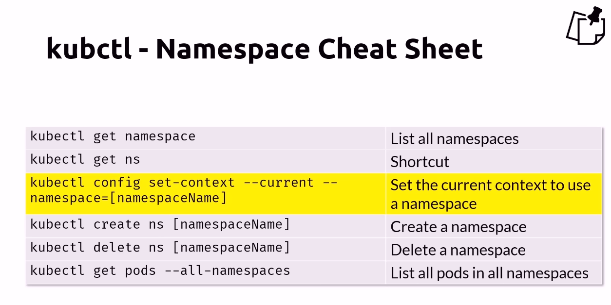
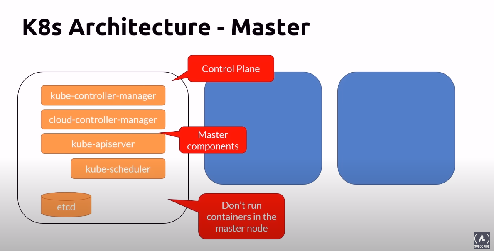
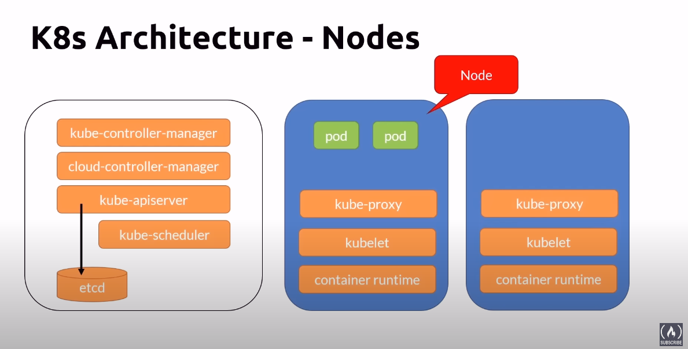
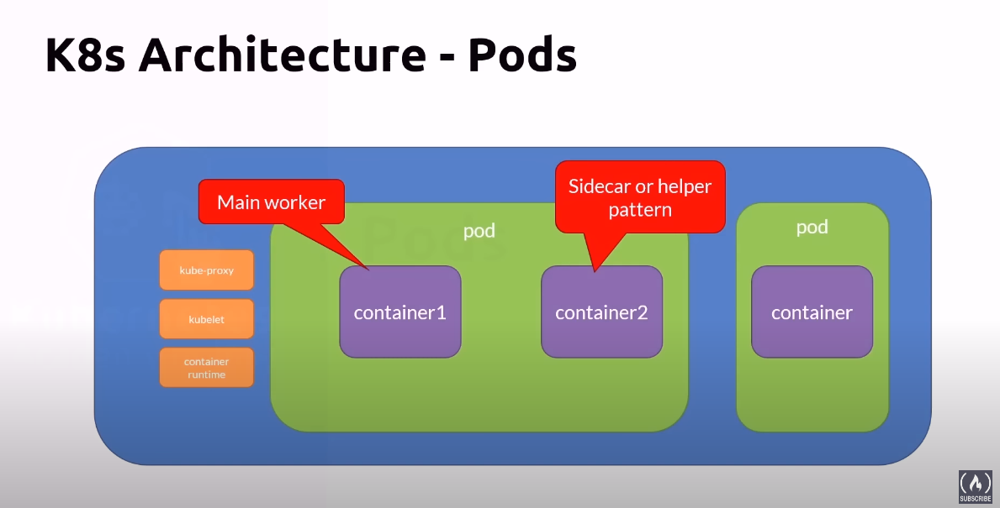
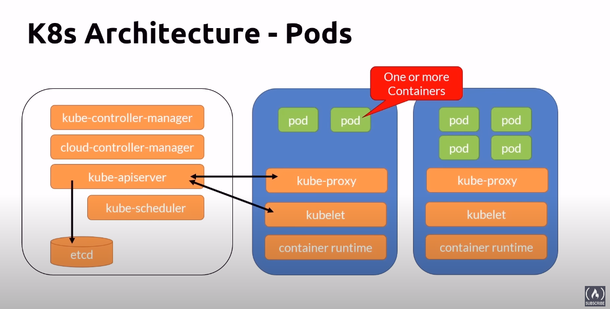
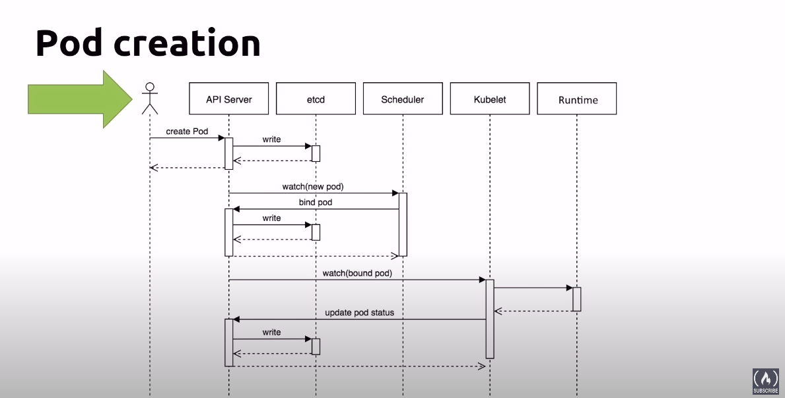
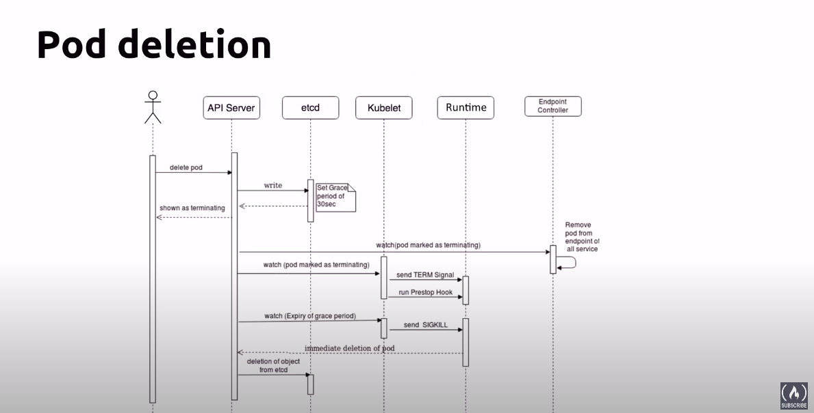
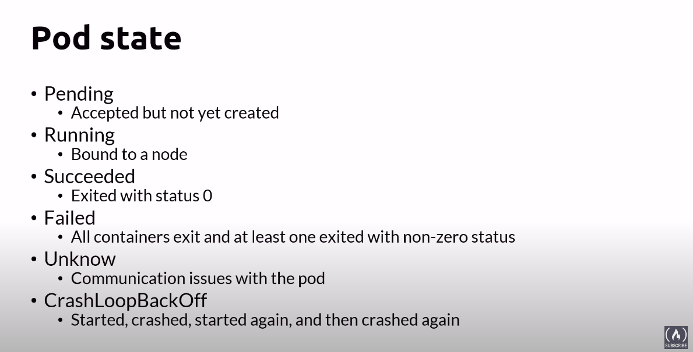

# List name spaces
kubectl get ns

# change context namespace

# Kubectl - Namespace cheat sheet

## K8s Architecture - Master

- **kube-apiserver**: Exposes an REST interface and client tools. Saves state to the datastore (etcd)
- etcd: Key value datastore for cluster state data (Only api server communicate with).
- **kube-control-manager**: controller, of controllers (node controller, replication controller, endpoints controller, service account & Token controllers)
- **cloud-control-manager**: Interact with cloud providers controllers
    - Node: Checking the cloud provider to determine if a node has beed deleted in the cloud after it stops responding.
    - Route: For setting up routes in the underlying cloud infrastructure.
    - Service: For creating, updating and deliting cloud provider load balancers.
    - volume: For creating, attaching, and mounting volumes, and interacting with the cloud provider to orchestrate volumes.
- **kube-scheduler**: Watches newle created pods that have no node assigned, and selects a node for them to run on.
- Addons
    - DNS
    - WEB UI (dashboard)
    - Cluster-level- logging
    - container resource monitor

## K8s Architecture - Nodes

A node is a phisical or virtual machine.

- **kubelet**: Manage the pods lifecycle. Are running and healthy
- **kubeproxy**: A network proxy. all network pass behing hm.
- **Container runtime**: cri-i, containerd, moby, rkt, kata, Virtlet

### Nodes pool

Is a group virtual machines, all with the same size.

## Pods

Pods are the smallest atomic unit of work of k8s. Encampsulates an application container. Is deployable.

### Pod creation

### Pod Deletion

### Pod state

